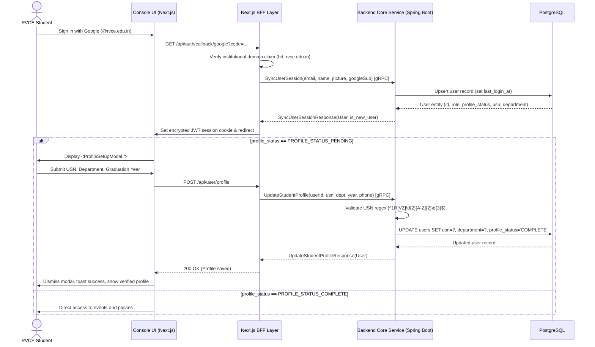

# Identity & Student Profile Architecture Design

> Status: Approved Foundation
>
> This document details the technical design, Protocol Buffer contracts, database schema, and decoupled implementation breakdown for the **Identity & Student Profile** backend feature.

---

## 1. Overview & Context

Currently, the RVCE Events platform has client-side Google OAuth 2.0 authentication (`@rvce.edu.in`) and a frontend profile setup modal (`ProfileSetupModal.tsx` from PR #37). However, user sessions are strictly client-cookie based and lack backend persistence. When a student completes the profile setup modal (submitting their USN and Department), the data is not yet persisted.

This feature establishes the **Identity & Student Profile** backend foundation:
- Synchronizing institutional Google OAuth claims into a persistent PostgreSQL `users` table.
- Tracking student onboarding status via `ProfileStatus` (`PENDING`, `PARTIAL`, `COMPLETE`, `SUSPENDED`).
- Allowing students to persist their USN, Department, Graduation Year, and Phone.
- Providing typed gRPC endpoints for profile synchronization and updates.

---

## 2. End-to-End Flow



---

## 3. Protocol Buffer Contracts

All protobuf files live under `api/proto/`:

### 3.1 Domain Model: `api/proto/models/user.proto`
Defines the core `User` entity, `UserRole`, `ProfileStatus`, and `Department` enums:
- `Department`: Encompasses all 15 RVCE engineering departments (`CSE`, `ISE`, `AIML`, `ECE`, `MECH`, etc.).
- `ProfileStatus`: Expresses onboarding states (`PENDING`, `PARTIAL`, `COMPLETE`, `SUSPENDED`).

### 3.2 Request/Response Schema: `api/proto/identity.proto`
Defines payloads for:
- `SyncUserSession`: Called by BFF upon OAuth token exchange.
- `UpdateStudentProfile`: Called when the student fills out the onboarding modal.
- `GetUserProfile`: Retrieves profile details for display in the navigation header.

### 3.3 Service Definition: `api/proto/service.proto`
Defines the unified `BackendService` hosting all identity RPCs on a single gRPC endpoint.

---

## 4. PostgreSQL Database Schema

Managed via Liquibase under `backend/database/liquibase/identity/001-create-users-table.xml`:

```sql
CREATE TABLE users (
    id UUID PRIMARY KEY DEFAULT gen_random_uuid(),
    email VARCHAR(255) NOT NULL UNIQUE,
    google_sub VARCHAR(255) UNIQUE,
    full_name VARCHAR(255) NOT NULL,
    avatar_url TEXT,
    role VARCHAR(50) NOT NULL DEFAULT 'ROLE_STUDENT',
    profile_status VARCHAR(50) NOT NULL DEFAULT 'PROFILE_STATUS_PENDING',
    
    -- Student Profile fields
    usn VARCHAR(20) UNIQUE,
    department VARCHAR(20),
    graduation_year INTEGER,
    phone VARCHAR(15),
    
    created_at TIMESTAMPTZ NOT NULL DEFAULT NOW(),
    updated_at TIMESTAMPTZ NOT NULL DEFAULT NOW(),
    last_login_at TIMESTAMPTZ NOT NULL DEFAULT NOW()
);

CREATE INDEX idx_users_email ON users(email);
CREATE INDEX idx_users_usn ON users(usn);
```

---

## 5. Decoupled Work Breakdown (Parallel Issues)

To allow contributors to build and test features concurrently without blocking one another, this feature is split into four decoupled components:

```text
+-------------------------------------------------------------------------+
| Step 0: Proto Contracts in main (api/proto/)                            |
+-------------------------------------------------------------------------+
       │
       ├───────────────────────────────────────────┐
       ▼                                           ▼
+──────────────────────────────────+  +──────────────────────────────────+
| Issue 1: Database & JPA Layer    |  | Issue 3: Frontend BFF API Route  |
| - Liquibase migration for users  |  | - Next.js /api/user/profile      |
| - UserEntity & UserRepository    |  | - Typed gRPC wrapper (mock mode) |
| - @DataJpaTest unit test         |  | - Vitest test                    |
+──────────────────────────────────+  +──────────────────────────────────+
       │                                           │
       ▼                                           ▼
+──────────────────────────────────+  +──────────────────────────────────+
| Issue 2: Backend gRPC Handler    |  | Issue 4: Modal UI Integration    |
| - BackendServiceImpl in Kotlin   |  | - Wire ProfileSetupModal submit  |
| - USN Regex validation           |  | - Loading/error feedback toasts  |
| - MockK unit tests               |  | - Storybook & dev auth testing   |
+──────────────────────────────────+  +──────────────────────────────────+
```

### Contributor Freedom & Schema Adjustments
> **Note for Contributors:**
> The Protobuf contracts and database schemas in this document serve as the baseline architecture. If during implementation you discover an edge case, performance optimization, or missing field, **you are encouraged to propose adjustments to the RPC schema or migrations in your PR/issue description** with technical reasoning.
